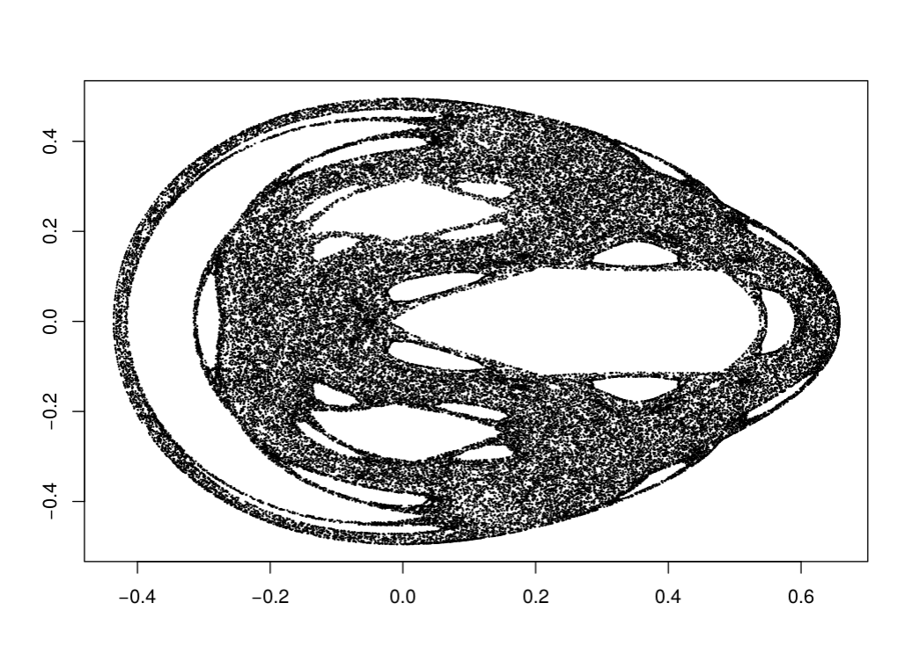

# A Lagrangian solver



**(A phase portrait of a chaotic Henon-Heiles system)**

## 

- *keywords*: Lagrangian, automatic differentiation, backpropagation, ODEs, PDEs
- *summary statistics*:
  - *Ada (2012)* : **7,933** lines of code
  - *C* : **63** lines of code

  1. [Introduction](#introduction)
  2. [Techniques used in this project](#techniques-used-in-this-project)
  3. [Overview of the method](#overview-of-the-method)
  4. [How to use this library](#how-to-use-this-library)
  5. [Future](#future)

## Introduction

This is the git repository for a new numerical solver I designed and developed that I simply call a *Lagrangian solver*. The method is derived and explained in a lot more detail in my thesis, which can be found in this directory.

A **Lagrangian** can be thought of as something even more *fundamental* to *Netwon's equations of motion*. Whereas Newton's equations of motion is a system of *ND* 2nd-order ordinary differential equations (ODEs), where *N* is the number of particles in your system and *D* is the number of spatial dimensions, a Lagrangian is a *single* expression from which the *ND* equations can be derived.

In short, given an expression for the Lagrangian, we can derive all of the Newton's equations of motion! If you think of science, and physics in particular, as being on a quest for the minimum number of concepts needed to explain everything, you can understand why the Lagrangian is often thought of as being more fundamental the Netwon's equations of motion.

Even though the Lagrangian is simpler, more elegant, and the thing physicists start from (as opposed to Newton's equations of motion), when we have to calculate things, we often have to derive Newton's equations of motion. Not only is this step tedious and error-prone (due to tediousness), it is, in some sense, the antithesis of the progress made in physics! And that is where my *Lagrangian solver* comes in!

By making use of **automatic differentiation** and the **collocation method**, we can avoid doing the aforementioned progress-reversing step ourselves!

## Techniques used in this project

The main conceptual techniques I make use of in this project are:
- the forward mode of **automatic differentiation** and
- the **collocation method**.

The *forward mode of automatic differentiation* is a way of getting the derivatives (gradients and Hessians in our case) of a function without *explicitly* calculating them. It is a variant of automatic differentiation. Another variant is the *reverse mode of automatic differentiation*, which is perhaps better known in *machine learning* as **backpropagation**.

*Collocation method* is a numerical method for solving differential equations. Strangely, while it is *somewhat* popular in solving *partial differential equations (PDEs)*, I have yet to see it be used for *ordinary differential equations (ODEs)*. And so, far as I'm aware, this is the first use of the collocation method for solving ODEs.

Beyond the two, I've also had to write a basic library for dealing with *sparse matrices*. The majority of what I had to write is the basic addition, subtraction, and multiplication of sparse matrices and vectors as well as a wrapper to a sparse linear solver. The sparse linear solver I made use of is called *CXSparse*, which is part of the [SuiteSparse library](http://faculty.cse.tamu.edu/davis/suitesparse.html).

## Overview of the method

This is just a brief overview for those with some familiar with *Lagrangian mechanics* and *automatic differentiation*. For clarification on the details, see Section *3.3* in [``The design, implementation, applications of a novel numerical solver: the Lagrangian solver''](https://gitlab.com/sciencylab/lagrangian-solver/blob/master/chan%20--%20a%20lagrangian%20solver.pdf).

Given a Lagrangian of the form
```math
L (\bold{x}(t), \bold{v}(t)),
```
where $`t`$ is time, $`\bold{x}(t)`$ are the particles' positions at time $`t`$, and $`\bold{v}(t)`$ are the particles' velocities at time $`t`$. Then the equations of motion governing the particles' trajectories are given by the **Euler-Lagrange equations**:
```math
\dfrac{d}{dt} \dfrac{\partial L}{\partial \bold{v}} - \dfrac{\partial L}{\partial \bold{x}} = 0.
```

The operator $`\dfrac{d}{dt}`$ can be represented as a linear operator $`\bold{D}`$ using the *collocation method*. The $`\dfrac{\partial L}{\partial \bold{x}}`$ and $`\dfrac{\partial L}{\partial \bold{v}}`$ can be calculated using automatic differentiation. The result of which is that the *Euler-Lagrange equations* gets converted into a system of non-linear equations.

Let us define $`\bold{y} = (\bold{x}, \bold{v})`$ and $`\bold{F}(\bold{y})`$ as
```math
\bold{F}(\bold{y}) = \bold{D} \dfrac{\partial L}{\partial \bold{v}} - \dfrac{\partial L}{\partial \bold{x}},
```
then our goal can be stated as find the solution $`\bold{y}(t))`$ for which $`\bold{F}(\bold{y}(t)) = 0`$.
To do so, we require the *Jacobian* of the $`\bold{F}(\bold{y})`$:
```math
\bold{J}(\bold{y}) = \dfrac{\partial \bold{F}}{\partial \bold{y}}.
```
The *Jacobian* $`\bold{J}`$ is therefore a linear combination of the *Hessian* of our Lagrangian $`L`$ (but is not the Hessian itself). Then, we can interative arrive at a solution (starting with an initial guess $`\bold{y}^{0}`$ and iterating up to some good-enough solution $`\bold{y}^{N}`$) using the *Newton-Raphson method*. That is, given $`\bold{y}^{(n)}`$, we can iteratively calculate a (hopefully) better solution $`\bold{y}^{(n+1)}`$ via
```math
\bold{y}^{(n+1)} := \bold{y}^{(n)} - \bold{J}(\bold{y}^{(n)})^{-1} \bold{F}(\bold{y}^{(n)})
```
until the solution has converged in some numerical sense such as
```math
\dfrac{||\bold{y}^{(n+1)} - \bold{y}^{(n)}|| }{ ||\bold{y}^{(n+1)}|| } < \varepsilon,
```
for some $`\varepsilon > 0`$, say $`10^{-15}`$.

Ignoring a lot of details, we can compare our approach here to, say, supervised learning. Because the goal in supervised learning is to optimize some assumed mathematical model (e.g. a neural network) and the number of parameters is huge, the *Newton's approach* to optimization would be overly expensive. Instead, the popular choice is to use some variant of *gradient descent*, which only requires the *gradient* of the *loss function* and not the *Hessian*. For our problem here, while the goal is to extremize some function (namely, the integral of the Lagragian from some intial time to some final time), it's easier to restate the problem as solving some system of non-linear equations (the Euler-Lagrange equations).  As a result, we require the *gradient* and *Hessian* of the Lagragian.

So, our overly simplified comparison is this. For supervised learning, the goal is to minimize a loss function and, to do that, only the *gradient* of the loss function is required. For computational classical mechanics, our goal is to solve a system of nonlinear equations when given a Lagrangian and, to do that, we require both the *gradient* and *Hessian* of the Lagragian.

## How to use this library

First, requirements:
- Ada 2012 compiler [(GNAT Ada compiler)](https://www.adacore.com/download)
- C compiler [(GNU C compiler)](https://gcc.gnu.org/)
- [CXSparse library (part of the SuiteSparse library)](http://faculty.cse.tamu.edu/davis/suitesparse.html)
- [Ovito](https://ovito.org/)

For now, the three examples available are:
- a simple pendulum problem,
- a chaotic Henon-Heiles problem, and
- a steel balls problem that's hard to explain solely in words (so I won't).

The driver files for these programs are contained in the directory *drivers* (along with many other driver files that were used for testing and exploration purposes), but to run these programs, follow the steps below.
1. Open a terminal on the parent directory (the one containing the file *main.gpr*).
2. Type the command below to compile all 3 examples listed above.
```bash
    gprbuild -P main.gpr  # main.gpr is a "project file" and functions
                          # similar to a Makefile
```
3. Then to run the files, use the commands below. Note that while the bin file *henon_heiles* does not take a file input, the other two do.

#### Chaotic Henon-Heiles:
*Note: This program will take a few minutes to finish running.*
```bash
    ./henon_heiles
```
This outputs *out.csv*. The following is the *R* code I use to import and plot the data (this should output the image shown at the top of this readme file):
```R
  data <- read.csv ("out.csv")
  plot (p2 ~ q2, data, pch = 10, cex = 0.2)
```


#### Pendulum:
```bash
    ./pendulum < param.txt
```
This outputs *pendulum.csv* which you can use, for example, R or python to visualize.

#### Steel Balls:
``` bash
    ./steel_balls < param-steel_balls.txt
```
This will output two files: *sb.xyz* and *sb.csv*.

- *sb.xyz* can be read into *Ovito*, a visualization program mainly meant for molecular dynamics. You can load it into *Ovito* via *Load file (Ctrl+I)*. Then, in the lower-right hand corner, inside the *XYZ* tab, click on *File contains time steps* (else it won't know to look for the particles' positions at other timesteps in the same file). Lastly, if the particles look like they're overlapping or not touching each other, confirm that the particle radius is set to *1*. Then click on the *Play* buttom near the bottom to start the animation.
- *sb.csv* contains more detailed information, but is not a file format readable by *Ovito*.


## Future

Many improvements and extension remain to be done and I'm not sure if I'll ever get to them. Nevertheless, let me note just two here (one of each).
1. The automatic differentiation here is implemented by overloading the various operators such as **+**, **-**, **\***, **/**, **and** (for tensor multiplication), and **or** (for direct summation). I don't know what's wrong, but this seems to be creating a lot of overhead, and the program is a lot slower than I expected.
2. Much like in regular molecular dynamics, by implementing a octree algorithm, it is possible to reduce the number of terms in the Lagrangian and get the same speedup as in molecular dynamics. (Also, I'll need to review the formulations of the various isostats, and implement them, before this will act as a proper molecular dynamics program.)
